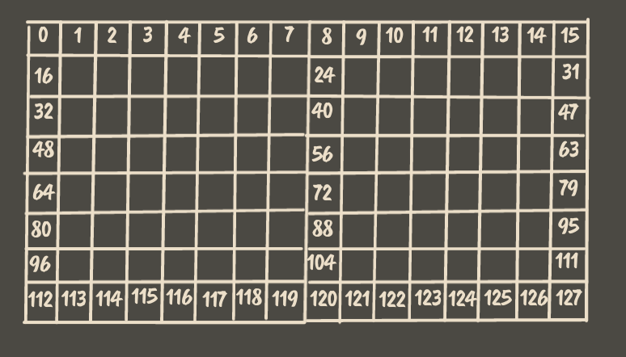

# 国际象棋棋局中，边界、可达性、方位与障碍检测

在国际象棋（以下简称国像）中，棋盘为 `8x8`，黑白方棋子各占上下两行，共 `32` 个

行走方式又分为 兵往左前、前、右前，马走日，象走 x，皇后走米，车走十，国王向周围八个方向走动

棋子的行走方式各不相同，在棋子要移动和攻击时，需要进行路径遍历、障碍物判断和合法路径边界判断。

<br />

## 边界

在程序中，一般是以 `8x8` 的二维数组来判断，那么边界判断的代码就是这样的

```ts
if ((col < 8 && col >= 0) && (row < 8 && row >= 0))
```


<br />

如果给 `8x8` 数组中的每个位置编号的话，就是这样的

```ts
if (idx >= 0 && idx < 64)
```


<br />

而使用位运算符，我们可以这样

```ts
if (!(idx & 0x40))
```

```ts
`0x40` 转换为

十进制 `64`

二进制 `01000000`
```

棋盘格子标号为 `0 - 63`，转换为二进制后 `第 7 位` 绝对为 0，所以 `0 - 63` 在和 `0x40` 与运算时都为 0，而 `64` - `127` 在与运算时，都为 1，负数则是补码运算，在任何时候都为 1。

寻找合法路径时，可以这样

```ts
const position = square.f6;
// 向上
position += 8;
// 向下
position -= 8;
// 向左上
position += 8 - 1;
// 向右下
position += -(8 - 1);

if (position & 0x40) break;
```

然而还是有缺点， `0x40` 在判断左右边界时很乏力

皇后 和 象 的可以以 x 的方式移动，当我们在棋盘上对它们的合法路径进行判断时，如果还使用 `0x40`，就无法判断 x 在什么时候沿伸到错误的位置


<br />

我们期望在获得到 39 后，寻找就结束，但情况并非如此

```ts
const legal_moves = [];
let position = square.f6; // 21

position += 8 + 1; // 30
if (!(position & 0x40)) legal_moves.push(position); // true

position += 8 + 1; // 39
if (!(position & 0x40)) legal_moves.push(position); // true

position += 8 + 1; // 48
if (!(position & 0x40)) legal_moves.push(position); // true

position += 8 + 1; // 57
if (!(position & 0x40)) legal_moves.push(position); // true

// ...
```


### 0x88 和 8x16

为了解决上面出现的错误，可以采用 `0x88` 和 `8x16` 来对棋盘格子标号进行 `按位与` 操作，从而检查是否超出棋盘之外，但在此之前，我们需要对棋盘进行一番改造



在 `8x16` 棋盘中，实际上只有 左边 `8x8` 可用，右边的 `8x8` 是作为边界判断 等 ~ 操作

在把上面的右下方向寻找步骤运行一遍


```ts
const legal_moves = [];
let position = square.f6; // 37

position += 16 + 1; // 54
if (!(position & 0x88)) legal_moves.push(position); // true

position += 16 + 1; // 71
if (!(position & 0x88)) legal_moves.push(position); // true

position += 16 + 1; // 88
if (!(position & 0x88)) legal_moves.push(position); // false
```

```ts
`0x88`  `0000000010001000`
`8`     `0000000000001000`

`0x80` 是对 `8x16` 棋盘的上下边界的检测
`0x08` 是对 右半边棋盘的检测
```

## 可达性

基于 `8x16` 的棋盘加上 `0x88` 也仅仅能够帮助我快速判断坐标是否在棋盘之内

然而这不够，在棋盘中，更多的是对棋子攻击是否可达、两个格子之间的空间关系和障碍判断做计算。

当一个马在棋盘上某个位置上时，它的攻击方式是确定的，我们用棋盘的结构上看它与可攻击的点时，它们有一个固定的关系，就是距离

当马在 `d4` 时，它某个攻击的点位就是 `e6`，当它在 `e4` 时，攻击点就是 `f6`，而它们之间的距离一直是 `-33` 或 `position + -(row * 2 - 1)`

那么 `d4` 马的可攻击范围就是

```md
c6 `-(row * 2 + 1) = -33`
e6 `-(row * 2 - 1) = -31`
c2 `row * 2 - 1 = 31`
e2 `row * 2 + 1 = 33`
f6、b6、b3、f3 ...
```

接下来就是两点之间的可达性判断，比如马在 `d4` ，而点击的棋子在 `a8` ，在正常情况下需要通过遍历马的目标点，判断 `a8` 是否在其中

这种方式倒也行，不过首先就是要收集在此坐标点上棋子可移动的目标点，让后在进行遍历

马的攻击较为简单，而皇后、车、象的就较为复杂，因为它们连移动的位置都需要遍历收集

当皇后站在 `h1` 时，是可以移动到 `g2、f3、e4、d5、c6、b7、a8 等` 的位置，在运行时遍历移动点和根据移动点遍历目标点时都很麻烦

以上，为了高效的判断两点之间是否可达，我们可以根据距离固定的特性生成一个距离静态表，而表中则记录各棋子能否达到此位置

棋盘的极限距离是 `h8 - a1 = 119`，考虑到可以从 `h8 -> a1` 也可以从 `a1 -> h8`，就是 `119 * 2`，还要还要考虑到棋子本身所占的位置

`119 * 2 + 1 = 239`

接下来需要生成一个表

```ts
const col = 8;
const row = 16;

// 棋盘格子的代称
enum Square {
    a1 = 'a1',
    a2 = 'a2',
    a8 = 'a8',
    h1 = 'h1',
}

// 棋盘坐标对于的标号
const SQUARE_MAP = {
    [Square.a1]: 112,
    [Square.a2]: 96,
    [Square.a8]: 0,
    [Square.h1]: 119,
};

const MAP_SIZE = (SQUARE_MAP[Square.h1] - SQUARE_MAP[Square.a8]) * 2 + 1;
```

因为要考虑到所有距离，直接从最极限的位置，也就是 `119 + 1` 的位置为基点，去计算 `1 -> 119` 这些距离，然后在该棋子的可达位置上标记即可

> 考虑到有 `6` 个棋子，这里直接使用 `<<` 和 `|` 来将是否可达存储在表中的数字中，验证时通过 `&` 来验证

首先声明每个棋子的位移距离

```ts
// 棋子声明
enum Pieces {
    /** 兵 */
    PAWN,
    /** 车 */
    ROOK,
    /** 马 */
    NIGHT,
    /** 象 */
    BISHOP,
    /** 皇后 */
    QUEEN,
    /** 王 */
    KING,
}

// 偏移个数
const ATTACK_BIT = {
    [Pieces.PAWN]: 0,
    [Pieces.NIGHT]: 1,
    [Pieces.BISHOP]: 2,
    [Pieces.ROOK]: 3,
    [Pieces.QUEEN]: 4,
    [Pieces.KING]: 5,
};
```

准备好之后，就可以通过枚举每个棋子的可达范围来给表中的元素加上标记

给图添加上标记

<details>
<summary>
代码
</summary>

```ts
const col = 8;
const row = 16;
const size = col * row;

const PIECE_OFFSETS = {
    [Pieces.PAWN]: [row - 1, row + 1, -(row - 1), -(row + 1)],
    [Pieces.NIGHT]: [-18, -33, -31, -14, 18, 33, 31, 14],
    [Pieces.BISHOP]: [-(row + 1), -(row - 1), row + 1, row - 1],
    [Pieces.ROOK]: [-row, row, -1, 1],
    [Pieces.QUEEN]: [-(row + 1), -(row - 1), row + 1, row - 1, -row, row, -1, 1],
    [Pieces.KING]: [-17, -16, -15, 1, -1, 17, 16, 15],
};

function piece_moves(piece: Pieces, position: number, map: number[], callback: (position: number, offset: number) => void) {
    const offset = PIECE_OFFSETS[piece];

    switch (piece) {
        case Pieces.PAWN: {
            for (let i = 0; i < offset.length; i++) {
                const v = position + offset[i];
                callback(v, offset[i]);
            }
            break;
        }
        case Pieces.NIGHT: {
            for (let i = 0; i < offset.length; i++) {
                const v = position + offset[i];
                callback(v, offset[i]);
            }
            break;
        }
        case Pieces.BISHOP: {
            let start = position;

            for (let j = 0; j < 2; j++) {
                for (let i = start + offset[j]; i >= 0; i += offset[j]) {
                    callback(i, offset[j]);
                }
            }

            for (let j = 2; j < 4; j++) {
                for (let i = start + offset[j]; i < map.length; i += offset[j]) {
                    callback(i, offset[j]);
                }
            }
            break;
        }
        case Pieces.ROOK: {
            let start = position - 7,
                end = position + 8;
            for (let i = start; i < end; i++) {
                if (i === position) continue;
                callback(i, i < position ? 1 : -1);
            }
            start = position % 16;
            for (let i = start; i < map.length; i += 16) {
                if (i === position) continue;
                callback(i, i > position ? 16 : -16);
            }
            break;
        }
        case Pieces.QUEEN: {
            let start = position - 7,
                end = position + 8;
            for (let i = start; i < end; i++) {
                if (i === position) continue;
                callback(i, i < position ? 1 : -1);
            }
            start = position % 16;
            for (let i = start; i < map.length; i += 16) {
                if (i === position) continue;
                callback(i, i > position ? 16 : -16);
            }

            start = position;

            const offset = [-(row + 1), -(row - 1), row + 1, row - 1];
            for (let j = 0; j < 2; j++) {
                for (let i = start + offset[j]; i >= 0; i += offset[j]) {
                    callback(i, offset[j]);
                }
            }

            for (let j = 2; j < 4; j++) {
                for (let i = start + offset[j]; i < map.length; i += offset[j]) {
                    callback(i, offset[j]);
                }
            }
            break;
        }
        case Pieces.KING: {
            const offset = [-17, -16, -15, 1, 17, 16, 15, -1];
            for (let i = 0; i < offset.length; i++) {
                const v = position + offset[i];
                callback(v, offset[i]);
            }
            break;
        }
    }
}

function genernal_map(pices: Pieces[], callback: (piece: Pieces, map: number[], position: number, offset: number) => void) {
    const map = new Array(MAP_SIZE).fill(0);

    const center = (map.length / 2) >> 0;

    // 棋子所在位置
    map[center] = 'x';

    // 遍历每个的攻击范围
    pices.forEach(piece => {
        piece_moves(piece, center, map, (position, offset) => {
            callback(piece, map, position, offset);
        });
    });

    return map;
}
```

</details>

<br />

核心代码

```ts
const attack_map = genernal_map([Pieces.PAWN, Pieces.NIGHT, Pieces.BISHOP, Pieces.ROOK, Pieces.QUEEN, Pieces.KING], (piece, map, position) => {
    // 将标记存储至 position 所在的位置
    const bit = 1 << ATTACK_BIT[piece];
    map[position] |= bit;
});
```

生成后的可达表


借助静态可达表快速判断是否可达

```ts
const PIECES_MAP = {
    [Pieces.PAWN]: 'p',
    [Pieces.ROOK]: 'r',
    [Pieces.NIGHT]: 'n',
    [Pieces.BISHOP]: 'b',
    [Pieces.QUEEN]: 'q',
    [Pieces.KING]: 'k',
};

class Piece {
    constructor(public type: Pieces, public color: 'b' | 'w') {}
}

class Chess {
    // ...
    move(from: Square, to: Square) {
        const [from_position, to_position] = [SQUARE_MAP[from], SQUARE_MAP[to]];
        const piece = this.board[SQUARE_MAP[from]];

        if (!piece) return null;

        const { color, type } = piece;

        if (color !== this.color) return null;

        // 计算两点之间的距离
        // + 119 是因为在 attack_map 表中距离偏移的问题
        let diff = from_position - to_position + 119;

        // 验证距离是否存储可达标记
        if (attack_map[diff] & (1 << ATTACK_BIT[type])) {
            this.remove(from);
            this.put(piece, to);
        }
    }
    // ...
}

const chess = new Chess();

chess.put(new Piece(Pieces.ROOK, 'w'), Square.a1);

console.log(chess.fen()); // 8/8/8/8/8/8/8/R7

chess.move(Square.a1, Square.a8);
console.log(chess.fen()); // R7/8/8/8/8/8/8/8

chess.move(Square.a8, Square.a1);
console.log(chess.fen()); // 8/8/8/8/8/8/8/R7
```

这只是解决了检测可达性的，并没有考虑到在移动过程中是否有障碍物的问题

<br />

## 方位与障碍检测

当知道了可达之后，就是要解决当前所在坐标与可达坐标之间是否存在障碍物

到了此步，我们如果想在棋子所有可达范围中获取目标点，最粗暴的是遍历所有可达点。

首先进行的就是偏移值计算，拿最复杂的皇后来说，

```md
d4(67) -> d5(51) = 67 - 51 = 16
d4(67) -> d6(35) = 67 - 35 = 32
d5(51) -> d4(67) = 51 - 67 = -16
```

在两点之间计算的情况下，从两点差距上并拿不到直接有效的数据，但是它们之间还是有共性，距离

在排除 马 外，其它棋子都有交叉的规律，可以据此在生成一个方向表

```ts
const direction_map = genernal_map([Pieces.QUEEN], (piece, map, position, offset) => {
    if (offset === 1 || offset === -1) map[position] = offset;
    else map[position] = -offset;
});
```


看回之前的 `d4 -> d5` 我们可以根据方向表来获取的向上偏移的偏移值，根据偏移值直接锁定到目标点位的方向

```ts
d4(67) -> d5(51) = 67 - 51 = 16

direction_map[d4 - d5 + 119] //  -16

// 从 d4 -> d5
// 在 from 和 to 一定存在棋盘且 to 包含在 from 的可达目标点时，from 和 to 肯定有一个终止条件
while(from !== to) {
    from += direction_map[d4 - d5 + 119];
}
```

通过 `direction_map` 可以直接获取到 `d4 -> d5` 的偏移值，我们也可以称它为方位

当获取到偏移值后，检测障碍物就简单多了，我只需要在上面的循环条件中添加一条

```ts
// 路径上是否存在棋子
while (from !== to && board[from] === undefined) {}

// from 和 to 如果一致，则到表中间没有任何障碍物
if (from !== to) {
    return null;
}
```

将障碍检测添加至 `move` 中

<details>
<summary>
    代码
</summary>

```ts
class Chess {
    move(from: Square, to: Square) {
        const [from_position, to_position] = [SQUARE_MAP[from], SQUARE_MAP[to]];
        const piece = this.board[SQUARE_MAP[from]];

        if (!piece) return null;

        const { color, type } = piece;
        if (color !== this.color) return null;

        // 计算两点之间的距离
        // + 119 是因为在 attack_map 表中距离偏移的问题
        let diff = from_position - to_position + 119;

        // 验证距离是否存储可达标记
        if (attack_map[diff] & (1 << ATTACK_BIT[type])) {
            const offset = direction_map[diff];
            let i = from_position + offset;

            // 障碍检测
            while (i !== to_position && this.board[i] === undefined) {
                i += offset;
            }

            if (i !== to_position) {
                return null;
            }

            this.remove(from);
            this.put(piece, to);
        }
    }
}
```

</details>

## 总结

从 0x88 到静态可达表和静态方位表，它解决了在象棋运行过程中较为复杂的基本逻辑，提供了一个基本运行的国象游戏基础

完!
